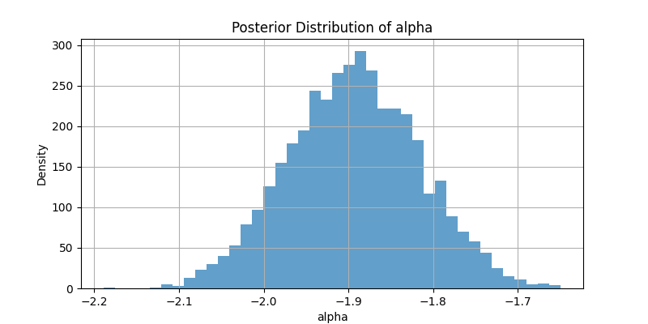
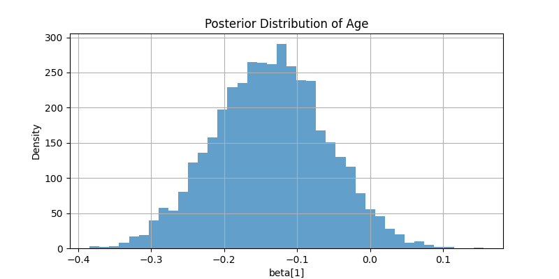
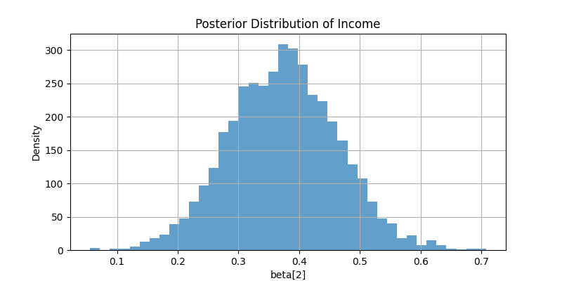
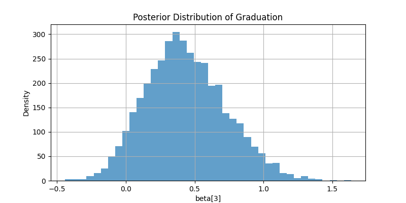
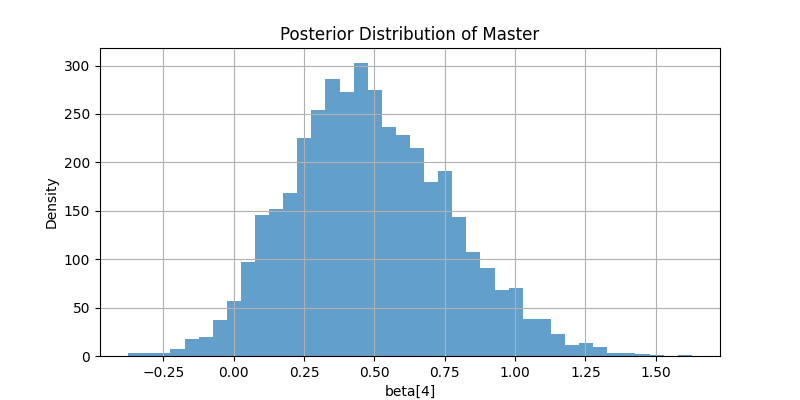

# Bayesian Modeling of Marketing Campaign Effectiveness

## 1. Introduction
This project analyzes the data provided at [Marketing Campaign](https://www.kaggle.com/datasets/rodsaldanha/arketing-campaign/data) using Bayesian logistic regression. The goal is to estimate the probability that a customer will subscribe based on demographic and campaign-related features. Bayesian inference is used to quantify uncertainty and provide interpretable probabilistic outputs.

## 2. Dataset Overview
The dataset includes 2240 customer records with features such as:
- **Age** (numeric)
- **Income** (numeric)
- **Education** (categorical: Basic, Graduation, Master, etc.)
- **Response** (target: (1/0) -> Yes/No)

### Target Variable
The target is whether the customer subscribed (**Response**).

## 3. Preprocessing Steps
- Handled missing values and filtered relevant rows.
- One-hot encoded `Education`, using Basic as the reference level.
- Standardized numeric variables (Age, Income).

## 4. Model Specification
A Bayesian logistic regression model was specified in Stan:
```stan
parameters {
    vector[K] beta;         // feature coefficients
    real alpha;             // intercept
}
model {
    beta ~ normal(0, 1);
    alpha ~ normal(0, 1);
    y ~ bernoulli_logit(alpha + X * beta);
}
```
- Priors: Normal(0, 1) for both `alpha` and `beta`
- Likelihood: Bernoulli logit model

## 5. Inference with CmdStanPy
- Used `CmdStanPy` to compile and sample from the model
- Ran 4 chains with 1000 samples each after warmup

## 6. Results and Interpretation

### Posterior Summary
| Parameter     | Mean   | 95% Credible Interval | R-hat |Interpretation                        |
|---------------|--------|------------------------|-------|---------------------------------|
| alpha         | -1.893560   | [-2.021620, -1.764630]   |    1.00155    | Baseline log-odds of subscription      |
| beta[1] (Age) | -0.136568    | [-0.264151, -0.010710]   |  1.00045   | Younger individuals are more likely to subscribe |
| beta[2] (Income) | 0.374332 | [0.229653, 0.519822]       |   1.00045  | Positive effect of income         |
| beta[3] (Graduation) | 0.435926 | [-0.012640, 0.943570]   |   1.00160     | Graduates more likely than Basic       |
| beta[4] (Master) | 0.486862 | [0.053738, 0.983116]       |   1.00137 | Masters more likely than Basic      |

### Posterior Distributions
Below are the posterior distributions of each parameter, illustrating the uncertainty around each estimate:

- Alpha


- Age



- Income



- Graduation



- Master



### Interpretation
- Age shows a negative effect on the probability of subscription. Older individuals are slightly less likely to subscribe, though the effect is modest.

- Income has a strong and positive effect, indicating higher-income individuals are significantly more likely to subscribe.

- Graduation level shows weak evidence of a positive effect, as the credible interval includes zero.

- Master’s degree shows a moderate positive effect, with a credible interval mostly above zero.

- The intercept (alpha) indicates a low baseline subscription probability for an average individual.

- All parameters have well-behaved diagnostics (R-hat ~ 1.00), indicating a reliable fit.

These insights can inform marketing strategies by highlighting that income and educational attainment (especially Master's level) are stronger indicators of customer responsiveness than age.

## 7. Conclusion
Bayesian analysis revealed that income and education level are significant predictors of subscription. The approach provided not just point estimates but also credible intervals, allowing for more informed decisions.

---

